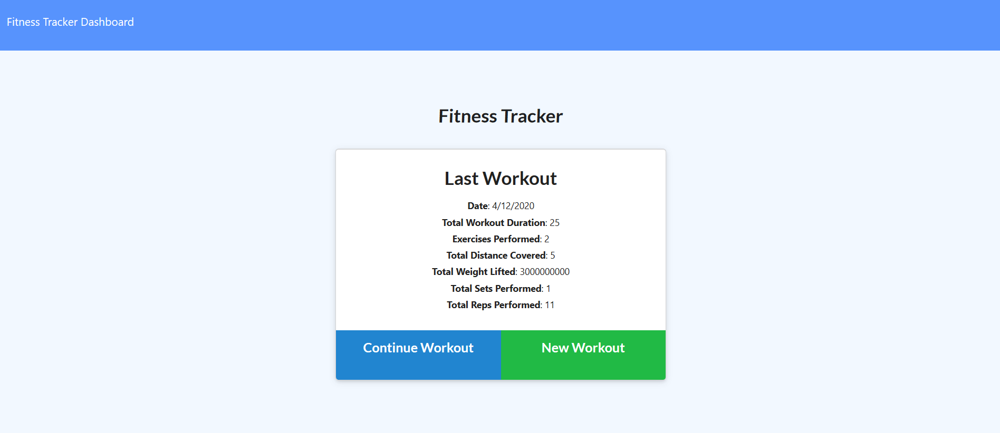

# NoSQL-Workout-Tracker

Build a workout tracker and save data with MongoDB and Mongoose. This is a back end project as the front end was supplied by Trilogy.

Production page: https://radiant-forest-96357.herokuapp.com/

## This repo contains:
* This README
* A Full-Stack Web app to track your workouts and the time it takes to do it, how many reps, what distance, etc.
* A mongoose schema for the database

## Known Issues / Bugs
* The total workout duration sometimes shows undefined, other times it shows the time correctly. Needs further investigation.

## What I Learned:
* I do not like using the MongoJS library or MongoJS. The layout of NoSQL servers isn't intutive to me and doesn't come as naturaally as MySQL did.
* I need much more work before I feel comfortable using MongoJS as a primary database solution.

## Conclusion:
* A tough challenge
